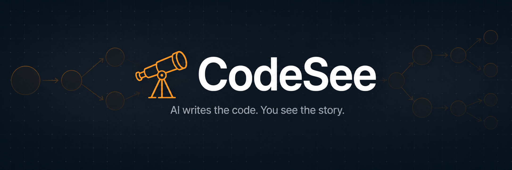
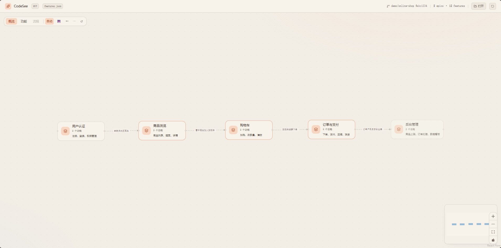
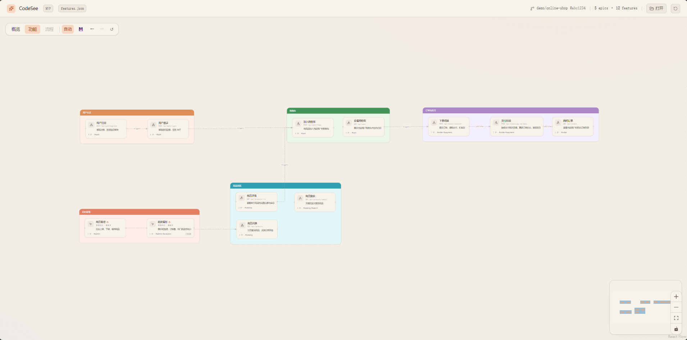
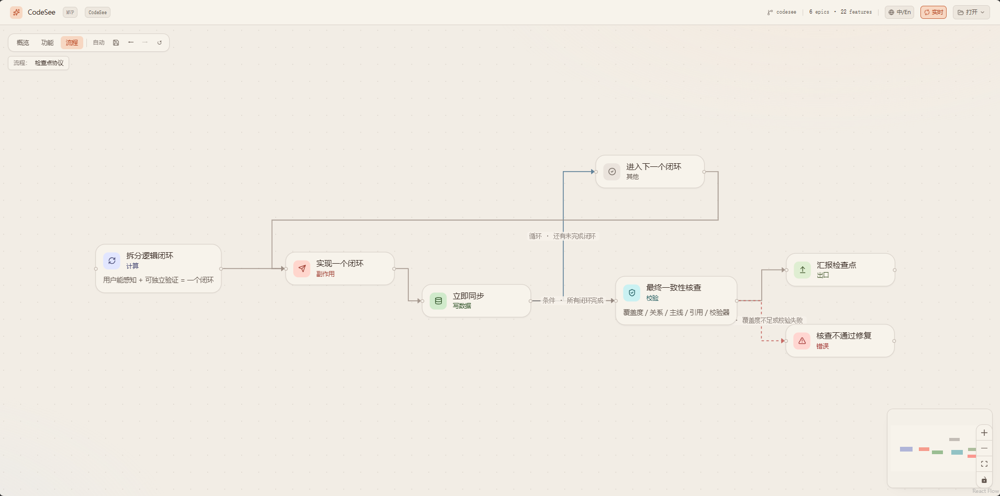

<div align="center">

[中文](./README.zh-CN.md) · English



# 🔭 CodeSee

**AI writes the code. You see the story.**

The feature-level canvas for AI-collaborative development. AI maintains a semantic flow graph of your project — you stay in control without reading every line.

[](./LICENSE)
[](./prompts/)
[](./viewer/)
[](./templates/AGENTS.md)


</div>

---

> Think of it like this: if a feature is "making scrambled eggs with tomatoes",
> the graph shows "prep → crack eggs → heat oil → stir-fry → season → plate" —
> not "`prepare()` calls `slice()` then `whisk()`".

Not call graphs. Not import maps. A human-readable story of what your project does.

<div align="center">

<p><em>Overview — Epics arranged by user journey order, connected by semantic flow arrows</em></p>
</div>

<div align="center">

<p><em>Features — grouped in Epic containers, drag to rearrange</em></p>
</div>

<div align="center">

<p><em>Steps — directed flow within a single feature (async, conditional, error branches)</em></p>
</div>

---

## Why

When collaborating with AI on code:

- 🤯 **AI writes 5000 lines in 5 minutes** — but you need hours to review them all
- 🔍 **You need to understand logic, not syntax** — "what does this feature do" matters more than "which function calls which"
- 🐛 **When something breaks, you trace the full chain** — but the chain might span 20 files you've never read
- 😤 **You lose the sense of ownership** — the project grows faster than your understanding of it

CodeSee solves this: AI writes the code AND writes the feature map. You see the story, not the syntax.

---

## Core Capabilities

| Capability | Description |
| ---------- | ----------- |
| **Semantic flow graph** | Three-level drill-down: Epics → Features → Steps. See the "what" and "why", not the "how". |
| **AI-maintained** | AI writes `features.json` after every code change. No manual diagramming. Works with any AI IDE. |
| **Interactive canvas** | Drag, zoom, undo/redo, auto-save layout. Warm-ivory theme designed for long review sessions. |
| **Zero lock-in** | Plain JSON file. Human-readable, git-diffable, lockable. Switch AI providers anytime. |
| **Incremental sync** | Each code change updates only affected features. The graph grows with your project. |
| **Validation** | Built-in validator catches schema violations, hallucinated enums, and structural issues before you see them. |
| **Multi-language** | UI supports Chinese/English toggle. Semantic text language configurable via `manifest.lang`. |

---

## Quick Start

### 1. Install into your project

```powershell
# Windows
.\scripts\install.ps1 D:\path\to\your\project

# macOS / Linux
./scripts/install.sh /path/to/your/project
```

This injects `AGENTS.md` + `.codesee/` (prompts, validator) into your project.

### 2. Let AI scan

Open your project in any AI IDE (Cursor / Claude Code / Kiro / Copilot).
The AI reads `AGENTS.md` and automatically generates `.codesee/features.json`.

### 3. View the graph

```bash
cd codeSee/viewer
npm install
npm run dev
```

Open `http://localhost:5173/`, drag in your `.codesee/features.json`.

---

## How It Works

```
Your Project/                      CodeSee Viewer/
├── AGENTS.md          ←───────── templates/AGENTS.md
├── .codesee/                      viewer/
│   ├── prompts/*.md   ←───────── prompts/*.md
│   ├── scripts/       ←───────── scripts/validate-features.mjs
│   ├── features.json  ──────────→ Drag into viewer
│   └── layout.json    ←───────── Saved from viewer (FSA)
└── your code
```

| Layer | What | Who maintains |
| ----- | ---- | ------------- |
| `features.json` | Semantic flow (epics, features, steps, relations) | AI + human review |
| `layout.json` | Node positions on canvas | User drag + auto-save |
| Viewer | Rendering, interaction, layout algorithms | This repo |

---

## Three Views

| View | Shows | Interaction |
| ---- | ----- | ----------- |
| **Overview** | Epics as nodes, `epic_flow` as edges | Drag to arrange; double-click → Features |
| **Features** | Features grouped in Epic containers | Drag nodes/containers; double-click → Steps |
| **Steps** | Step-by-step flow within one feature | Directed graph with async/conditional/error edges |

---

## Best Practices

### Two usage scenarios

| Scenario | When | How |
| -------- | ---- | --- |
| **A. Greenfield (recommended)** | Starting a new project from scratch with AI | Install CodeSee first, then develop. AI updates `features.json` after each feature it writes. |
| **B. Brownfield** | Adding CodeSee to an existing project | Run a full scan first, then switch to incremental sync. |

### Why Greenfield is the best practice

When you develop from zero with CodeSee integrated from day one:

- **AI never loses context** — it just wrote the code, so it knows exactly what each step does, which lines to reference, and how features connect
- **Granularity stays fine** — each sync covers one small feature, not 50 features at once
- **No hallucination risk** — AI doesn't need to guess what existing code does; it wrote it moments ago
- **The graph grows with your project** — you can review the canvas at any point and catch design issues early
- **refs are precise** — file paths and line numbers are accurate because the code was just written

### Greenfield workflow

```
1. Install CodeSee into your empty project
2. Tell AI: "Build feature X"
3. AI writes code → AI updates features.json (trigger 2 in AGENTS.md)
4. You review the canvas → spot issues → tell AI to fix
5. Repeat for next feature
```

The canvas becomes your **living architecture diagram** that's always in sync with reality.

### Brownfield workflow

```
1. Install CodeSee into your existing project
2. AI runs scan (trigger 1) → generates full features.json
3. You review on canvas → lock correct features → tell AI to fix wrong ones
4. From now on, every code change triggers incremental sync
```

---

## Design Principles

1. **Semantic control belongs to AI / features.json** — node order, naming, grouping, relations
2. **Visual & interaction belongs to the viewer** — drag, zoom, theme, layout algorithms
3. **When in doubt, let AI write it explicitly** — no heuristic inference in the frontend

Full details: [`docs/principles.md`](./docs/principles.md)

---

## Project Structure

```
codeSee/
├── viewer/                  Canvas frontend (Vite + React + React Flow + Tailwind v4 + ELK)
│   ├── src/{fcg,graph,app,lib}
│   └── public/{features,layout}.json   Example data
├── prompts/                 AI prompt templates (copied to target projects)
│   ├── scan.md              Entry point (routes to light/heavy)
│   ├── scan-light.md        Light projects (one-shot)
│   ├── scan-heavy.md        Heavy projects (phased)
│   ├── sync.md              Incremental sync
│   ├── _schema.md           Schema + enums + example (single source of truth)
│   └── _rules.md            Constraints (MUST/SHOULD/MAY)
├── templates/               AGENTS.md templates
├── scripts/                 Install script + validator
├── docs/                    Design docs
├── LICENSE                  MIT
└── README.md
```

---

## FAQ / Troubleshooting

<details>
<summary><strong>Viewer shows a blank white screen after loading features.json</strong></summary>

The AI likely used enum values outside the schema (e.g. `role: "logic"` instead of `role: "compute"`).

1. Run the validator: `node .codesee/scripts/validate-features.mjs`
2. Fix the reported errors (usually invalid `step.role`, `flow.kind`, or `trigger.kind`)
3. Reload the viewer

The viewer has fallback handling for unknown enums, but severely malformed JSON can still cause issues.
</details>

<details>
<summary><strong>Browser doesn't show the directory picker when I click 💾</strong></summary>

The File System Access API only works in Chromium-based browsers (Chrome, Edge, Arc). Firefox and Safari don't support it.

- Use Chrome or Edge
- Make sure you're on `localhost` or HTTPS (FSA is blocked on `file://`)
- If it still doesn't work, the viewer falls back to localStorage (your layout is still saved, just not to a file)
</details>

<details>
<summary><strong>Overview is just a horizontal line</strong></summary>

The AI assigned sequential `order` values (0, 1, 2, ..., N) to every Epic instead of grouping parallel modules under the same order.

Fix in `features.json`: Epics that represent parallel capabilities should share the same `order` value. Only use different orders for sequential stages in the user journey.
</details>

<details>
<summary><strong>AI keeps inventing enum values not in the schema</strong></summary>

This is the most common issue. The prompts include strict enum tables, but some models still hallucinate.

- Always run the validator after AI writes/updates `features.json`
- The validator reports exact JSONPath locations of invalid values
- Common mappings: `logic` → `compute`, `init`/`cleanup` → `other`, `websocket` → `http`, `internal` → `event`
</details>

<details>
<summary><strong>How do I update CodeSee in my project after pulling new changes?</strong></summary>

Re-run the install script with `-Force` (PowerShell) or `--force` (Bash):

```powershell
.\scripts\install.ps1 D:\path\to\your\project -Force
```

This refreshes prompts, validator, and the AGENTS.md CodeSee section without touching your `features.json` or `layout.json`.
</details>

---

## Roadmap

- [ ] **Screenshots & demo GIF** — real project visualization examples
- [ ] **Canvas editing** — edit feature names, add notes, lock nodes directly on the canvas
- [ ] **Search & filter** — find features by name, filter by epic/tag/role
- [ ] **Diff view** — highlight what changed between two versions of `features.json`
- [ ] **Multi-project dashboard** — switch between projects without re-dragging files
- [ ] **CI integration** — validate `features.json` in GitHub Actions / GitLab CI
- [ ] **Export** — PNG / SVG / PDF export of the current view
- [ ] **Dark theme** — toggle between warm-ivory and dark mode
- [ ] **Plugin system** — custom node renderers, custom layout algorithms

---

## Contributing

1. Fork & clone
2. `cd viewer && npm install && npm run dev`
3. Make changes, ensure `npm run build` passes
4. Open a PR

---

## License

[MIT](./LICENSE)
