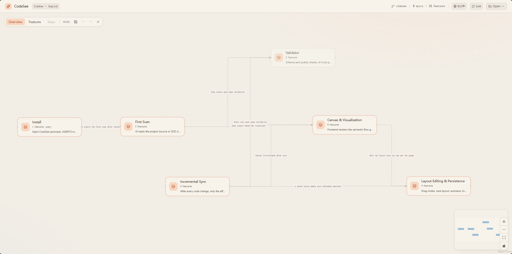
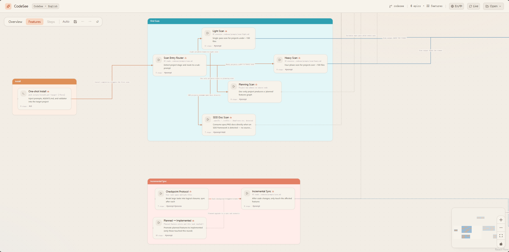
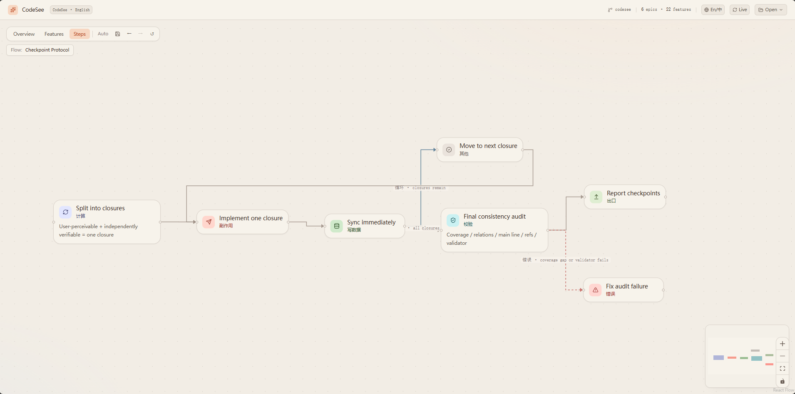

<div align="center">


# CodeSee

**The feature graph your AI auto-maintains.**

Stop reading every line of AI-generated code. See a semantic flow graph of your project — auto-updated as AI works, never stale.

[](./LICENSE)
[](https://Kaka-cheaper.github.io/codeSee/?example=codesee-en)
[](./viewer/package.json)
[](https://github.com/Kaka-cheaper/codeSee/commits/main)
[](https://github.com/Kaka-cheaper/codeSee/issues)
[](./README.zh-CN.md)
[![LINUX DO](https://img.shields.io/badge/LINUX-DO-FFB003.svg?logo=data:image/svg%2bxml;base64,DQo8c3ZnIHhtbG5zPSJodHRwOi8vd3d3LnczLm9yZy8yMDAwL3N2ZyIgd2lkdGg9IjEwMCIgaGVpZ2h0PSIxMDAiPjxwYXRoIGQ9Ik00Ni44Mi0uMDU1aDYuMjVxMjMuOTY5IDIuMDYyIDM4IDIxLjQyNmM1LjI1OCA3LjY3NiA4LjIxNSAxNi4xNTYgOC44NzUgMjUuNDV2Ni4yNXEtMi4wNjQgMjMuOTY4LTIxLjQzIDM4LTExLjUxMiA3Ljg4NS0yNS40NDUgOC44NzRoLTYuMjVxLTIzLjk3LTIuMDY0LTM4LjAwNC0yMS40M1EuOTcxIDY3LjA1Ni0uMDU0IDUzLjE4di02LjQ3M0MxLjM2MiAzMC43ODEgOC41MDMgMTguMTQ4IDIxLjM3IDguODE3IDI5LjA0NyAzLjU2MiAzNy41MjcuNjA0IDQ2LjgyMS0uMDU2IiBzdHlsZT0ic3Ryb2tlOm5vbmU7ZmlsbC1ydWxlOmV2ZW5vZGQ7ZmlsbDojZWNlY2VjO2ZpbGwtb3BhY2l0eToxIi8+PHBhdGggZD0iTTQ3LjI2NiAyLjk1N3EyMi41My0uNjUgMzcuNzc3IDE1LjczOGE0OS43IDQ5LjcgMCAwIDEgNi44NjcgMTAuMTU3cS00MS45NjQuMjIyLTgzLjkzIDAgOS43NS0xOC42MTYgMzAuMDI0LTI0LjM4N2E2MSA2MSAwIDAgMSA5LjI2Mi0xLjUwOCIgc3R5bGU9InN0cm9rZTpub25lO2ZpbGwtcnVsZTpldmVub2RkO2ZpbGw6IzE5MTkxOTtmaWxsLW9wYWNpdHk6MSIvPjxwYXRoIGQ9Ik03Ljk4IDcwLjkyNmMyNy45NzctLjAzNSA1NS45NTQgMCA4My45My4xMTNRODMuNDI2IDg3LjQ3MyA2Ni4xMyA5NC4wODZxLTE4LjgxIDYuNTQ0LTM2LjgzMi0xLjg5OC0xNC4yMDMtNy4wOS0yMS4zMTctMjEuMjYyIiBzdHlsZT0ic3Ryb2tlOm5vbmU7ZmlsbC1ydWxlOmV2ZW5vZGQ7ZmlsbDojZjlhZjAwO2ZpbGwtb3BhY2l0eToxIi8+PC9zdmc+)](https://linux.do/)

[](https://github.com/github/spec-kit)
[](https://github.com/mindfold-ai/Trellis)
[](https://github.com/bmad-code-org/BMAD-METHOD)
[](https://agentskills.io/)

</div>

> ⚠ **Active development.** Schema may change between minor versions. Track [CHANGELOG](./CHANGELOG.md) for breaking changes. Currently the most accurate way to follow progress is the [commit history](https://github.com/Kaka-cheaper/codeSee/commits/main).

---

> Think of it like this: if a feature is "making scrambled eggs with tomatoes",
> the graph shows "prep → crack eggs → heat oil → stir-fry → season → plate" —
> not "`prepare()` calls `slice()` then `whisk()`".

Not call graphs. Not import maps. A human-readable story of what your project does.

<div align="center">

### ▶ [Try it in 30 seconds — no install](https://Kaka-cheaper.github.io/codeSee/?example=codesee-en)

<sub>Open the live demo · click the <strong>🧭 Guided Tour</strong> button at the top — 2 minutes to understand the project · or drop your own <code>features.json</code></sub>

</div>

<div align="center">

<p><em>Overview — Epics arranged by user journey order, connected by semantic flow arrows</em></p>
</div>

<details>
<summary><strong>▶ More views (Features / Steps)</strong></summary>

<div align="center">

<p><em>Features — grouped in Epic containers, drag to rearrange</em></p>
</div>

<div align="center">

<p><em>Steps — directed flow within a single feature (async, conditional, error branches)</em></p>
</div>

</details>

---

## Why

When collaborating with AI on code:

- 🤯 **AI writes 5000 lines in 5 minutes** — but you need hours to review them all
- 🔍 **You need to understand logic, not syntax** — "what does this feature do" matters more than "which function calls which"
- 🐛 **When something breaks, you trace the full chain** — but the chain might span 20 files you've never read
- 😤 **You lose the sense of ownership** — the project grows faster than your understanding of it

CodeSee solves this: AI writes the code AND writes the feature map. You see the story, not the syntax.

---

## Why I built this

I'm an independent developer who got tired of AI writing 5000 lines in 5 minutes
while I spent hours figuring out what changed.

I tried call graphs, import maps, AST tools — all wrong layer. They show *how* code
calls itself, not *what* the project does for the user.

CodeSee is the tool I wished I had when working with Cursor / Claude Code on real
projects. After iterating on **Polisim** (40+ features simulation engine) and a
**美团 AI Hackathon** project to validate the schema and prompts, I'm sharing it.

The three rules that emerged from real use:

1. **Semantic control belongs to AI / `features.json`** — naming, ordering, grouping
2. **Visual & interaction belongs to the frontend** — drag, zoom, theme, layout
3. **When uncertain, let AI write it down explicitly** — no frontend heuristics

— [@Kaka-cheaper](https://github.com/Kaka-cheaper) · [LinuxDo](https://linux.do/)

---

## Core Capabilities

| Capability | Description |
| ---------- | ----------- |
| **Guided Tour** 🧭 | Not a map to stare at — a path to walk. Each step poses a question first, lets you predict at key forks, then reveals the answer as nodes light up one by one. The full graph unlocks only after you finish. [Why a tour, not a better map? →](#why-a-tour-not-a-better-map) |
| **Semantic flow graph** | Three-level drill-down: Epics → Features → Steps. See the "what" and "why", not the "how". |
| **AI-maintained** | AI writes `features.json` after every code change. No manual diagramming. Works with any AI IDE. |
| **Interactive canvas** | Drag, zoom, undo/redo, auto-save layout. Warm-ivory theme designed for long review sessions. |
| **Multi-project switcher** | Top-bar dropdown to switch between projects (FSA folders / uploaded files / bundled examples) — no re-dragging. Authorized folders auto-restore across refreshes. |
| **Live reload** | Toggle the Live button — viewer polls `features.json` every 3s and auto-refreshes the canvas with smooth fade-in for new nodes. Watch the graph grow as AI works. |
| **Zero lock-in** | Plain JSON file. Human-readable, git-diffable, lockable. Switch AI providers anytime. |
| **Incremental sync** | Each code change updates only affected features. The graph grows with your project. |
| **Validation** | Built-in validator catches schema violations, hallucinated enums, and structural issues before you see them. |
| **Multi-language** | UI supports Chinese/English toggle. Semantic text language configurable via `manifest.lang`. |
| **SDD compatible** | Auto-detects `.specify/`, `.trellis/`, `.bmad-core/`, `.agents/skills/` and consumes spec/PRD docs directly — no source-code reverse engineering. |
| **SKILL.md standard** | Cross-platform skill following [agentskills.io](https://agentskills.io/) — works on Claude Code / Cursor / Codex / Gemini CLI / Copilot / 20+ platforms out of the box. |
| **Auto hook wiring** | One-shot `install --auto-detect` writes a Stop hook into Claude Code / Kiro that reminds AI to sync `features.json` after every agent turn. Existing user hooks untouched, idempotent, `--uninstall-hooks` reverses cleanly. |

---

## When NOT to use

- ❌ **Single-file scripts or tiny prototypes** — overkill, just read the code
- ❌ **Pure documentation projects with no code** — you can use planning mode, but a wiki/Notion may serve better
- ❌ **Codebases without AI collaboration** — manual maintenance defeats the point; the value is "AI writes it for you"
- ❌ **Real-time low-latency monitoring** — `features.json` is sync-on-change, not millisecond-live
- ❌ **Dependency / call graph analysis** — that's the wrong layer; use [Madge](https://github.com/pahen/madge), [dependency-cruiser](https://github.com/sverweij/dependency-cruiser), or your IDE's built-in analyzer

If you're an independent dev / small team using Cursor / Claude Code / Kiro / Copilot to ship features and you keep losing track of what your codebase actually does — that's the sweet spot.

---

## Quick Start

### 1. Clone this repo

```bash
git clone https://github.com/Kaka-cheaper/codeSee.git
cd codeSee
```

The install scripts, prompts, validator, and templates live here. The viewer is hosted on GitHub Pages so you don't need to run it locally.

### 2. Install CodeSee into your project

```powershell
# Windows
.\scripts\install.ps1 D:\path\to\your\project

# macOS / Linux
./scripts/install.sh /path/to/your/project
```

Drops `AGENTS.md` (or appends to existing) plus `.codesee/{prompts,scripts,hooks}/` into your project. Zero changes to your code.

**Optional — wire hooks in one shot.** Re-run with `-AutoDetect` (PowerShell) / `--auto-detect` (Bash):

```powershell
.\scripts\install.ps1 D:\path\to\your\project -AutoDetect
```

Looks for `.claude/`, `.kiro/`, or `.cursor/` and writes the Stop / agentStop / stop hook so the IDE reminds AI to sync `features.json` after every turn. Existing user entries are untouched, reruns are idempotent, and `-UninstallHooks` cleans up. For manual setup or per-platform docs see [`hooks/README.md`](./hooks/README.md).

### 3. Let AI scan

Open your project in any AI IDE (Cursor / Claude Code / Kiro / Copilot / Codex / Gemini CLI / ...).
The AI reads `AGENTS.md` (or `.agents/skills/codesee/SKILL.md` for SKILL.md-compatible IDEs) and automatically generates `.codesee/features.json`.

If your project uses a Spec-Driven Development framework (`.specify/`, `.trellis/`, `.bmad-core/`, ...), CodeSee will detect it and consume the spec/PRD docs directly — no source code scan needed.

### 4. View the graph (in your browser, no install)

Open **[https://Kaka-cheaper.github.io/codeSee/](https://Kaka-cheaper.github.io/codeSee/?example=codesee-en)** — the live web viewer.

By default you'll see CodeSee's own feature graph. To switch to your project:

1. Click **+ Add project** in the top-right dropdown
2. Pick the folder containing `.codesee/features.json` — you'll get a one-time browser permission prompt
3. Done. The browser reads your local files directly via the [File System Access API](https://developer.mozilla.org/en-US/docs/Web/API/File_System_Access_API) — never uploads anything.

All your previous projects stay in the dropdown — next time you open the viewer, just click to switch.

> **Browser support**: Chrome / Edge / Arc / Brave (Chromium-based). Firefox/Safari users can drag a `features.json` file in instead — layout still saves to localStorage.

> **Want to run viewer locally?** See [Development setup](./CONTRIBUTING.md#development-setup) — `cd viewer && npm run dev`.

---

## How It Works

```
Your Project/                              CodeSee Viewer/
├── AGENTS.md                  ←────────── templates/AGENTS.md
├── .agents/skills/codesee/    ←────────── templates/SKILL.md  (cross-platform skill)
│   └── SKILL.md
├── .codesee/                              viewer/
│   ├── prompts/*.md           ←────────── prompts/*.md  (scan / scan-sdd / sync / ...)
│   ├── scripts/               ←────────── scripts/validate-features.mjs
│   │                                    + hooks/scripts/check-staleness.mjs
│   ├── hooks/                 ←────────── hooks/{claude-code,kiro,cursor,README.md}
│   ├── features.json          ──────────→ Loaded by viewer (add project / drag)
│   └── layout.json            ←────────── Saved from viewer (FSA, same folder as features.json)
├── .claude/settings.json      ←────────── (optional) merged Stop hook via --auto-detect
├── .kiro/hooks/codesee-*.kiro.hook ←───── (optional) wired via --auto-detect
├── .cursor/hooks.json         ←────────── (optional) merged stop hook via --auto-detect
└── your code  (or .specify / .trellis / .bmad-core / ... for SDD projects)
```

| Layer | What | Who maintains |
| ----- | ---- | ------------- |
| `features.json` | Semantic flow (epics, features, steps, relations) | AI + human review |
| `layout.json` | Node positions on canvas | User drag + auto-save |
| Viewer | Rendering, interaction, layout algorithms | This repo |

---

## Three Views

| View | Shows | Interaction |
| ---- | ----- | ----------- |
| **Overview** | Epics as nodes, `epic_flow` as edges | Drag to arrange; double-click → Features |
| **Features** | Features grouped in Epic containers | Drag nodes/containers; double-click → Steps |
| **Steps** | Step-by-step flow within one feature | Directed graph with async/conditional/error edges |

Plus an optional **`tours` field**: AI can generate a guided tour with
`prompts/scan-tour.md` — the viewer plays it as a step-by-step journey across
Overview and Features views.

---

## Why a tour, not a better map?

Human working memory holds **4±1 chunks** (Cowan, 2001). A canvas with 22 feature
nodes is physiologically impossible to *understand* at a glance — it can only be
*looked at*. No amount of highlighting or filtering fixes this, because the
bottleneck isn't the picture; it's brain bandwidth.

People understand complex systems by **walking a path in order**, not by staring
at a map — that's why anyone can follow a two-hour movie (hundreds of events!) but
nobody can read a 22-node diagram. The movie serializes for you: one chunk at a
time, hooked together by causality.

So CodeSee's tour: each step opens a curiosity gap with a question *before*
showing the answer, asks you to **predict** at key forks (people only retain what
they generate themselves — and wrong guesses stick hardest), then lights up nodes
one by one with the camera following. The full map unlocks only at the end:
**the map is the diploma, not the textbook.**

Every one of these choices is a cognitive-science finding turned into a schema
constraint. Full design rationale with references → [docs/cognitive-design.md](./docs/cognitive-design.md)

---

## Best Practices

### Three usage scenarios

| Scenario | When | How |
| -------- | ---- | --- |
| **A. Greenfield (recommended)** | Starting a new project from scratch with AI | Install CodeSee first, then develop. AI updates `features.json` after each feature it writes. |
| **B. SDD project** | Project already uses spec-kit / Trellis / BMAD / Agent Skills | CodeSee auto-detects and consumes spec/PRD docs directly — most accurate, fewest tokens. |
| **C. Brownfield** | Adding CodeSee to an existing code-only project | Run a full code scan first, then switch to incremental sync. |

### Why Greenfield is the best practice

When you develop from zero with CodeSee integrated from day one:

- **AI never loses context** — it just wrote the code, so it knows exactly what each step does, which lines to reference, and how features connect
- **Granularity stays fine** — each sync covers one small feature, not 50 features at once
- **No hallucination risk** — AI doesn't need to guess what existing code does; it wrote it moments ago
- **The graph grows with your project** — you can review the canvas at any point and catch design issues early
- **refs are precise** — file paths and line numbers are accurate because the code was just written

### Greenfield workflow

```
1. Install CodeSee into your empty project
2. Tell AI: "Build feature X"
3. AI writes code → AI updates features.json (trigger 2 in AGENTS.md)
4. You review the canvas → spot issues → tell AI to fix
5. Repeat for next feature
```

The canvas becomes your **living architecture diagram** that's always in sync with reality.

### Brownfield workflow

```
1. Install CodeSee into your existing project
2. AI runs scan (trigger 1) → generates full features.json
3. You review on canvas → lock correct features → tell AI to fix wrong ones
4. From now on, every code change triggers incremental sync
```

### SDD project workflow

```
1. Install CodeSee — install script auto-detects your SDD framework
2. AI reads .codesee/prompts/scan-sdd.md → consumes your spec/PRD docs
3. Each task done in your SDD framework → AI runs sync (no re-scanning code)
4. The canvas reflects your spec library, not your code structure
```

This is the highest-fidelity path: spec → features.json is forward projection (preserves intent), while code → features.json is reverse engineering (loses intent).

---

## Design Principles

1. **Semantic control belongs to AI / features.json** — node order, naming, grouping, relations
2. **Visual & interaction belongs to the viewer** — drag, zoom, theme, layout algorithms
3. **When in doubt, let AI write it explicitly** — no heuristic inference in the frontend

Full details: [`docs/principles.md`](./docs/principles.md)

---

## Project Structure

```
codeSee/
├── viewer/                  Canvas frontend (Vite + React + React Flow + Tailwind v4 + ELK)
│   ├── src/{fcg,graph,app,lib}
│   └── public/
│       ├── features.json    Default example: CodeSee modeling itself (live demo)
│       ├── examples/        Other bundled examples
│       │   └── blog-system.json
│       └── layout.json      Default canvas layout
├── prompts/                 AI prompt templates (copied to target projects)
│   ├── scan.md              Entry point (auto-routes: sdd / planning / light / heavy)
│   ├── scan-sdd.md          SDD projects (spec-kit / Trellis / BMAD / Agent Skills)
│   ├── scan-light.md        Light projects (one-shot)
│   ├── scan-heavy.md        Heavy projects (phased)
│   ├── scan-planning.md     Doc-only / planning stage
│   ├── scan-tour.md         Guided-tour generation (experimental; installed, runs only on explicit request)
│   ├── sync.md              Incremental sync
│   ├── _schema.md           Schema + enums + example (single source of truth)
│   └── _rules.md            Constraints (MUST/SHOULD/MAY)
├── templates/               Entry-rule templates
│   ├── AGENTS-snippet.md    Single source of truth for the AGENTS.md CodeSee section (BEGIN/END marked)
│   └── SKILL.md             Cross-platform skill entry (agentskills.io standard)
├── hooks/                   Cross-IDE hooks (copied to target as .codesee/hooks/)
│   ├── README.md            Enablement guide
│   ├── scripts/
│   │   └── check-staleness.mjs   Shared: detects stale features.json after each turn
│   ├── claude-code/
│   │   └── settings.json    Stop hook template (merged into .claude/settings.json)
│   ├── kiro/
│   │   └── sync-on-stop.kiro.hook  agentStop hook (dropped into .kiro/hooks/)
│   └── cursor/
│       ├── hooks.json       Native stop hook template (merged into .cursor/hooks.json)
│       └── codesee-stop.mjs Thin wrapper → followup_message when stale
├── scripts/                 Install + tooling
│   ├── install.ps1
│   ├── install.sh
│   ├── validate-features.mjs       Schema + heuristic validator
│   ├── merge-claude-settings.mjs   Idempotent JSON merge for .claude/settings.json
│   └── merge-cursor-hooks.mjs      Idempotent JSON merge for .cursor/hooks.json
├── docs/                    Design docs
├── LICENSE                  MIT
└── README.md
```

---

## FAQ / Troubleshooting

<details>
<summary><strong>How can the browser read files from my disk? Is that safe?</strong></summary>

CodeSee uses the [File System Access API](https://developer.mozilla.org/en-US/docs/Web/API/File_System_Access_API), a modern web standard. Three things make it safe:

1. **You explicitly choose the folder.** The browser shows a folder picker — nothing happens unless you click "Allow". Same UX as opening a file in any web app.
2. **The browser sandboxes access.** Only that one folder you picked is readable, and only by `https://Kaka-cheaper.github.io/`. Refresh the page → permission resets to `prompt` until you re-grant.
3. **Nothing leaves your machine.** The viewer is a static site (HTML/JS/CSS only) — there's no backend, no upload, no analytics. All file reads happen in your browser. You can verify by checking the Network tab — only the viewer assets load, nothing else.

Even if you don't trust me: clone the repo, read [`viewer/src/fcg/fileSystem.ts`](./viewer/src/fcg/fileSystem.ts) (the only file that touches FSA), and see for yourself. Or just run viewer locally — see [Development setup](./CONTRIBUTING.md#development-setup).
</details>

<details>
<summary><strong>Viewer shows a blank white screen after loading features.json</strong></summary>

The AI likely used enum values outside the schema (e.g. `role: "logic"` instead of `role: "compute"`).

1. Run the validator: `node .codesee/scripts/validate-features.mjs`
2. Fix the reported errors (usually invalid `step.role`, `flow.kind`, or `trigger.kind`)
3. Reload the viewer

The viewer has fallback handling for unknown enums, but severely malformed JSON can still cause issues.
</details>

<details>
<summary><strong>Save button doesn't work / no directory picker shows up</strong></summary>

CodeSee uses the File System Access API for local read/write. Only available in Chromium browsers (Chrome, Edge, Arc).

- Use Chrome or Edge to open the viewer
- Must access via `localhost` or HTTPS (FSA is blocked on `file://`)
- **Before your first save, click "+ Add project" in the top-bar dropdown and pick a folder containing `features.json`** — that's the unified auth entry. After authorization, the save button, autosave, and live reload all work directly without re-prompting for the folder
- Without authorization, save only writes localStorage drafts (still survives refresh, but not to disk)
- Browser restart may reset FSA permission to `prompt` — the canvas will show a re-authorization banner; one click on **Reauthorize** is enough
- Firefox/Safari users: the viewer falls back to localStorage and your layout is still saved
</details>

<details>
<summary><strong>How do I switch between multiple projects?</strong></summary>

The **Open ▼** dropdown in the top-bar has two sections:

- **Your projects** — folders or uploaded files you've added before, sorted by last opened, hover to remove
- **Examples** — CodeSee itself, blog-system example

Click any row to switch instantly. FSA projects auto-restore across page refreshes and browser restarts — once authorized, you never need to re-pick the folder.

The active project is remembered in localStorage; next time you open the viewer it loads where you left off.
</details>

<details>
<summary><strong>Overview is just a horizontal line</strong></summary>

The AI assigned sequential `order` values (0, 1, 2, ..., N) to every Epic instead of grouping parallel modules under the same order.

Fix in `features.json`: Epics that represent parallel capabilities should share the same `order` value. Only use different orders for sequential stages in the user journey.
</details>

<details>
<summary><strong>AI keeps inventing enum values not in the schema</strong></summary>

This is the most common issue. The prompts include strict enum tables, but some models still hallucinate.

- Always run the validator after AI writes/updates `features.json`
- The validator reports exact JSONPath locations of invalid values
- Common mappings: `logic` → `compute`, `init`/`cleanup` → `other`, `websocket` → `http`, `internal` → `event`
</details>

<details>
<summary><strong>How do I enable / disable hooks?</strong></summary>

Easiest way to enable: rerun install with `--auto-detect`.

```powershell
.\scripts\install.ps1 D:\my-project -AutoDetect
```

That does three things:

1. Merges the Stop hook into `.claude/settings.json` (only if `.claude/` exists)
2. Writes `.kiro/hooks/codesee-sync-on-stop.kiro.hook` (only if `.kiro/` exists)
3. Merges the stop hook into `.cursor/hooks.json` (only if `.cursor/` exists; uses a thin wrapper that emits `followup_message` when stale)

Every entry we write carries a `_codesee` marker field. Claude Code / Cursor ignore unknown fields, but we use it to identify our entries on subsequent runs — reruns are idempotent, your other hooks stay untouched.

Once enabled, after every agent turn the IDE runs the shared staleness check (`node .codesee/scripts/check-staleness.mjs`, or via the Cursor wrapper). The script compares `manifest.generated_at` against `git log` and prints a reminder if code changed but `features.json` did not. Always exits 0 — never blocks the agent.

Disable:

```powershell
.\scripts\install.ps1 D:\my-project -UninstallHooks
```

Removes only the marker-tagged entries plus `.kiro/hooks/codesee-*.kiro.hook`. The `.codesee/hooks/` templates stay so you can re-enable any time.

For per-platform manual setup or Git hook fallback see [`hooks/README.md`](https://github.com/Kaka-cheaper/codeSee/blob/main/hooks/README.md).
</details>

<details>
<summary><strong>How do I update CodeSee in my project after pulling new changes?</strong></summary>

Re-run the install script with `-Force` (PowerShell) or `--force` (Bash):

```powershell
.\scripts\install.ps1 D:\path\to\your\project -Force
```

This refreshes prompts, validator, and the AGENTS.md CodeSee section without touching your `features.json` or `layout.json`.
</details>

<details>
<summary><strong>My project uses spec-kit / Trellis / BMAD — does it just work?</strong></summary>

Yes. The install script auto-detects these directories:

- `.specify/` — GitHub Spec Kit
- `.trellis/` — Mindfold Trellis
- `.bmad-core/` or `bmad/` — BMAD-METHOD
- `.agents/skills/` — Agent Skills standard
- `.agent-os/` — Builder Methods Agent OS

When detected, the install script reports which framework it found, and `scan.md` routes to `scan-sdd.md` which consumes spec/PRD docs directly. No source code scan needed — far more accurate than reverse engineering.
</details>

<details>
<summary><strong>What's the difference between AGENTS.md and SKILL.md?</strong></summary>

`AGENTS.md` is the original entry-rule format used by Cursor, Claude Code, Kiro, etc. — placed at project root.

`SKILL.md` is the [agentskills.io](https://agentskills.io/) cross-platform standard (Anthropic, December 2025) used by 20+ AI tools. Placed at `.agents/skills/codesee/SKILL.md`. It uses progressive disclosure (only ~30-50 tokens load at startup, full instructions load on demand).

The install script writes both — your AI IDE will pick whichever it understands.
</details>

---

## Roadmap

> **Want to contribute?** Many of the open items below have matching issues with concrete scope and acceptance criteria. Check the **[`good first issue`](https://github.com/Kaka-cheaper/codeSee/issues?q=is%3Aopen+is%3Aissue+label%3A%22good+first+issue%22)** and **[`help wanted`](https://github.com/Kaka-cheaper/codeSee/issues?q=is%3Aopen+is%3Aissue+label%3A%22help+wanted%22)** labels.

### Top priority

- [ ] **Prompt refinement (community-driven)** — real-world usage produces the best constraints; contributions welcome for edge cases, anti-patterns, and domain-specific rules
- [ ] **Incremental scan + self-correction** — replace one-shot 15K-token output with per-epic / per-feature streaming + self-review loops to fix long-output quality decay. Research design (Self-Refine / Reflexion lineage) and three implementation tiers documented in [`docs/improving-scan-quality.md`](docs/improving-scan-quality.md). Not started; tier 1 (per-epic) is the recommended entry point (~6h).
- [ ] **Semantic-aware layout** — layout should respect feature logic, not just node positions. Phase 1 done: ELK Sugiyama tuning (`considerModelOrder` makes the array order in features.json influence layout, `BRANDES_KOEPF` node placement aligns upstream/downstream, larger edge-node spacing prevents label collisions); next: Feature.order field, swimlane view, AI-driven semantic layout intent.
- [ ] **Plan-as-Graph** — AI outputs its plan/design directly as `features.json` so you review it on the canvas instead of reading walls of text. Approve, edit, or discard before any code is written. Extends CodeSee from "post-hoc documentation" to "pre-implementation design review".
- [ ] **Feature Summary (AI memory layer)** — a deterministic script auto-generates a compact markdown summary from `features.json` (~2000 tokens vs 15000+ for raw JSON). AI reads the summary at session start to restore project context instantly. Solves long-task forgetting and cross-session inconsistency.
- [ ] **Incremental patch output protocol** — `sync` prefers RFC 6902 JSON Patch over full file rewrite. Phase 1 done: `scripts/apply-patch.mjs` implements the patch applier (zero-deps, supports add/remove/replace/move/copy/test ops + atomic write + automatic rolling backup); `sync.md` gained an output-protocol section with mode A (patch first) and mode B (full rewrite fallback). Next: validate token savings on a real heavy project (Polisim, 40+ features), iterate on prompt examples and recovery strategy from real failures.
- [x] **Platform hooks** — auto-trigger sync via Claude Code / Kiro / Cursor hooks. Phase 1 done: hook templates + shared `check-staleness.mjs` shipped to `.codesee/hooks/`. Phase 2 done: install gains `--auto-detect` / `--enable-claude-code` / `--enable-kiro` to wire the IDE config in one shot. Phase 3 done: Cursor native `stop` hook with `followup_message` wrapper + `--enable-cursor` / AutoDetect on `.cursor/`; existing user entries are untouched, reruns are idempotent, `--uninstall-hooks` cleans up.

### Ecosystem & integrations

- [x] **SDD framework integration** — auto-detect `.specify/` (Spec Kit), `.trellis/` (Trellis), `.bmad-core/` (BMAD), `.agents/skills/` and consume spec/PRD docs as the source for `features.json` (forward projection from spec instead of reverse engineering from code)
- [x] **SKILL.md standard entry** — cross-platform skill following [agentskills.io](https://agentskills.io/), works on Claude Code / Cursor / Codex / Gemini CLI / Copilot / 20+ platforms
- [x] **Real-time canvas refresh** — local watcher detects `features.json` changes and auto-refreshes the web canvas (no manual reload), so users see the graph update live as the AI works

### Canvas & UX

- [x] **Guided tour (v1)** — question-first, predict-at-forks, nodes light up one by one; full map unlocks at the end. Hand-written tour ships with the bundled example. Design rationale: [docs/cognitive-design.md](./docs/cognitive-design.md)
- [ ] **AI-generated tours** — iterate `prompts/scan-tour.md` quality against the north-star metric: minutes until a newcomer correctly answers their first transfer question about the codebase
- [ ] **Question-driven trails (tour v2)** — ask "what breaks if I change X?" → AI writes a temporary tour JSON → viewer's file watcher picks it up and plays a 5-8 node trail, disposable after walking
- [ ] **Share via URL (remote `features.json`)** — load any URL-accessible `features.json` via `?features=<url>` (or `?repo=<owner>/<repo>` GitHub shorthand). Drop a link in a README / doc / chat and recipients see the live graph instantly — no clone, no install. Read-only mode (layout drafts go to localStorage). Strong fit for OSS project showcasing and code-review sharing.
- [ ] **Canvas editing** — edit feature names, add notes, lock nodes directly on the canvas
- [ ] **Search & filter** — find features by name, filter by epic/tag/role
- [ ] **Diff view** — highlight what changed between two versions of `features.json`
- [x] **Multi-project dashboard** — top-bar dropdown to switch between projects (FSA folders / uploaded files / bundled examples), no re-dragging
- [ ] **Export** — PNG / SVG / PDF export of the current view
- [ ] **Dark theme** — toggle between warm-ivory and dark mode

### Tooling

- [ ] **CI integration** — validate `features.json` in GitHub Actions / GitLab CI
- [ ] **Plugin system** — custom node renderers, custom layout algorithms
- [ ] **Zero-clone install** — `curl ... | bash` one-liner that fetches scripts/prompts/templates from GitHub raw, no `git clone` needed

### Long-term (optional)

- [ ] **HTML artifact complement** — keep features.json as the project-level contract (unchanged), and give AI a prompt path to render "one-shot task outputs" (design alternatives / PR walkthroughs / learning reports / disposable custom editors) as standalone HTML files. Background: [Thariq Shihipar's post](https://thariqs.github.io/html-effectiveness/). Viewer could also gain "export current canvas as shareable HTML". Two layers complement each other: long-term evolution lives in codesee, single-shot artifacts live in HTML.
- [ ] **Vector index** — semantic embedding for "find similar features" / cross-project reuse; must remain optional and never replace the JSON-as-source-of-truth principle

---

## Community

- 💬 [LinuxDo](https://linux.do/) — Discussion & feedback
- 🐛 [GitHub Issues](https://github.com/Kaka-cheaper/codeSee/issues) — Bug reports & feature requests

---

## Contributing

See [CONTRIBUTING.md](./CONTRIBUTING.md) for development setup, code style, and PR process.

Quick start:

1. Fork & clone
2. `cd viewer && npm install && npm run dev`
3. Make changes, ensure `npm run build` passes
4. Open a PR

---

## License

[MIT](./LICENSE)

---

<div align="center">

Built with ❤️ by **[@Kaka-cheaper](https://github.com/Kaka-cheaper)** — independent dev exploring AI-collaborative workflows.

Found this useful? **[Star ⭐ on GitHub](https://github.com/Kaka-cheaper/codeSee)** · **[Say hi on LinuxDo](https://linux.do/)**

If you ship something with CodeSee, [open an issue](https://github.com/Kaka-cheaper/codeSee/issues/new) — I'd love to feature it.

</div>
